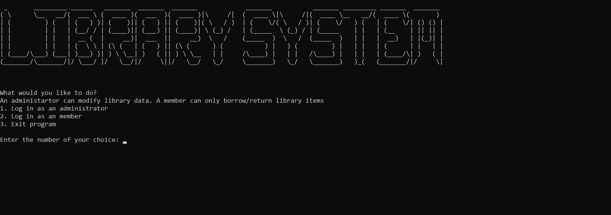

# Library Management System

A **library** stores items (books, articles, and digital media) to be accessed by people (members); it contains a unique id and a name.

An **item** is stored in a particular library (books, articles, and digital media); it contains four mandatory fields: a unique ID, a reference to a specific library, the type of item, and a name. 
In addition, it includes three optional fields depending on the item type:
- Author of a book - If the item type is a 'book.'
- Journal of the article - If the item type is an 'article.'
- Format of the Media - If the item type is 'Digital Media.'

A **member** refers to the people who can access items from a library; it contains a unique ID, first name, last name, and email.

**_The Library Management System:_**
- Load data (borrowing, items, library, and members data) into memory from the data text files.
- Save data (borrowing, items, library, and members data) from memory into the data text files.

To access the Library Management System, there are two user types:
1. An administrator who can modify library data. They have the following privileges:
    - Add/Edit/Delete/Display Libraries.
    - Add/Edit/Delete/Display Items of a particular library.
2. A member who can only borrow/return library items (Identified by their Member ID). They have the following privileges:
    - Add/Edit their Member profile.
    - Display Libraries.
    - Display/Borrow/Return items of a particular library.
    - Access pending and completed borrowing transactions.

# Requirements  (Prerequisites)

Python 3.10.4 and up [Install](https://www.python.org/downloads/)

# Installation

Clone this project in your local machine.
Run the main program file.
 
# Features

1. Back navigation and exit options.
2. Ensure a person can only borrow an item that they have returned.
3. Properly format the files and output to minimize extra whitespace.
4. Only show the necessary information in the return menu.
5. Ensure string input is required.
6. Inform users of successful and unsuccessful operations.
7. Ensure Library ID, Item ID, and Member ID are unique.
8. One can only borrow/return if logged in as a member
9. Properly handle None value of items yet to be returned.
10. Delete the library and its items but leave borrowing records (analysis)
11. Ensure the user's choices are in the valid range.
12. Ensure email input is valid.
13. One should only modify existing data.
14. Ensure there is no library with an ID of 00, 01, or 02 since they'll be a collision in the library menu.

# Assumptions

There is no direct manipulation of the data files.

# Author

The author of this project is Richard Odhiambo.

 You can find me here at:
[Github](https://github.com/o-richard)

# License

This project is licensed under the MIT License.